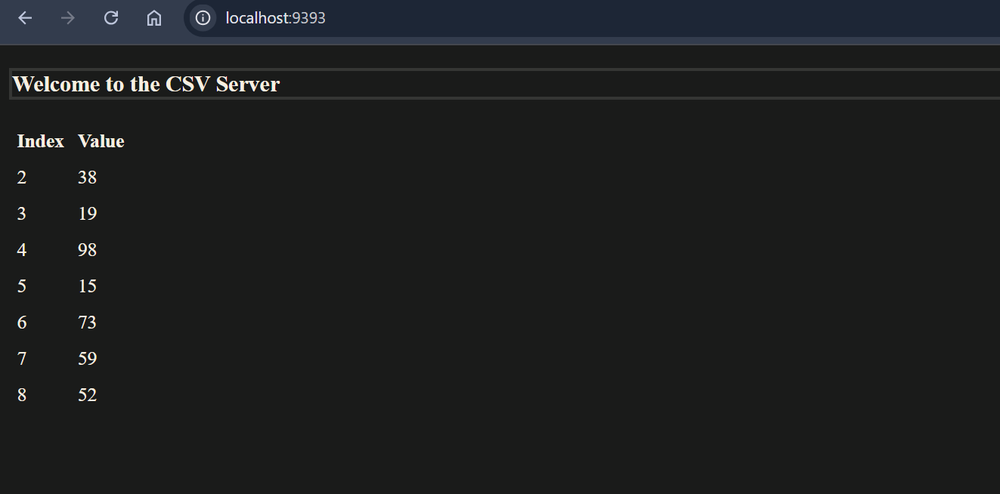

Prerequisites(Part-1): Docker Installed 

**As Given in repository use these to pull the images.**

docker pull infracloudio/csvserver:latest
docker pull prom/prometheus:v2.45.2

Verify the docker images using command:

 **docker images**: 

*Part-1*
Q-1: Run the container image infracloudio/csvserver:latest in background and check if it's running.

**docker run -d infracloudio/csvserver**

It failed to start the container.

Q-2:If it's failing then try to find the reason, once you find the reason, move to the next step.

**Reason**

**docker run -it infracloudio/csvserver**

Q-3: Write a bash script gencsv.sh to generate a file named inputFile whose content looks like:
0, 234
1, 98
2, 34
These are comma separated values with index and a random number.
Running the script with two arguments as ./gencsv.sh 2 8, should generate the file inputFile with 7 such entries in current directory. Where the index of first entry is 2 and the last entry is 8.

**vi gencsv.sh**

write the following code:

Give the shell script the execuatble permission using:

**chmod +x gencsv.sh**

Execute the shell script using:

**./gencsv.sh**

This will generate the inputFile as asked in question with 7 entries.

Q-4 Run the container again in the background with file generated in (3) available inside the container (remember the reason you found in (2)).

**Since we know that the required directory for running the container was not present previously and now as per question we have to run the container with file (inputFile) we recently created.**
**To do this we use the concept of volume mounting**

 **docker run -d -v $(pwd)/inputFile:/csvserver/inputdata infracloudio/csvserver**

 Verifying:

 Q-5 Get shell access to the container and find the port on which the application is listening. Once done, stop / delete the running container.

 **docker exec -it 57b2 /bin/bash**  ##57b2 initials of container id""

 Port on which application is listening is found using:

 **netstat -tnlp**

To stop the container:

First exit from the running container using **exit** command.

Then use:

**docker stop 57b2**

To permanently remove:

**docker rm 57b2**

Q-6 Same as (4), run the container and make sure,
The application is accessible on the host at http://localhost:9393

Set the environment variable CSVSERVER_BORDER to have value Orange.

**To solve this question we use port forwarding method for forwarding the traffic coming on application port which is 9300 to hostPort 9393 which is specified using -p flag**
**To change the border color we are given with environment variable which we can use by specifying -e flag**

**docker run -d -p 9393:9300 -v /root/csvserver/solution/inputFile:/csvserver/inputdata -e CSVSERVER_BORDER=Orange infracloudio/csvserver**

***Part II***

Commands used :

**apt install docker-compose**

**vi docker-compose.yaml**

.png)

**cat csvserver.env**

***CSVSERVER_BORDER=Orange***

***To start the server using docker compose use:***

**docker-compose up -d**

***To access the server : In the browser use***

 **localhost:9393**

***Result with border **WHITE**:*** 

